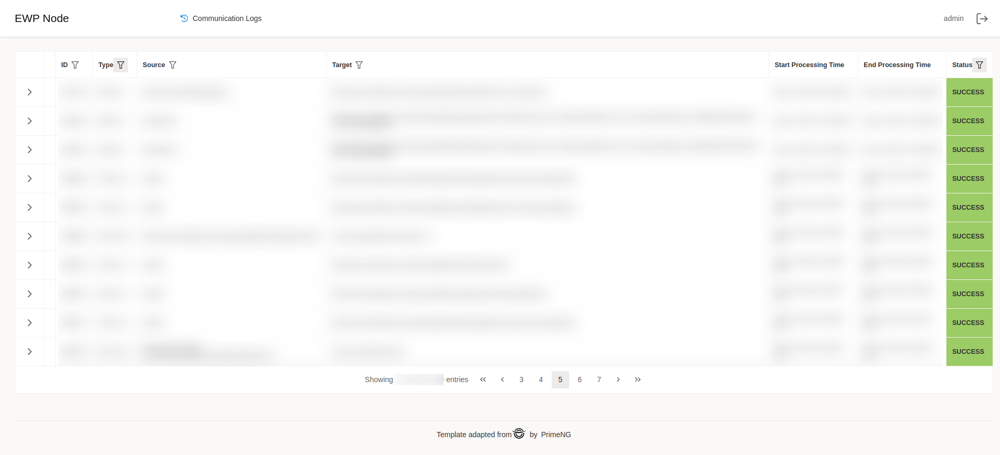

# Admin Dashboard

The EWP Node includes an admin dashboard at /admin that allows to check received/sent communication logs from/to other EWP nodes, 
as well communications from hosts and to them via host plugins.

The credentials of access are configured on the applications.yml file, namely with the keys admin.security.username and admin.security.password.

